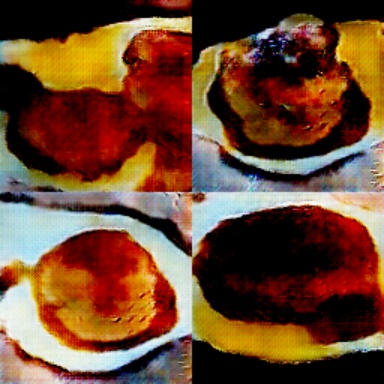

# gan

Derived from the MNIST GAN example https://github.com/apache/incubator-mxnet/blob/master/contrib/clojure-package/examples/gan/src/gan/gan_mnist.clj

This is an example of how to train GANs with your own images. In this example it is flans.
To use, you must collect your images and store that in a .rec file. Use this guide to get started [https://mxnet.incubator.apache.org/faq/recordio.html](https://mxnet.incubator.apache.org/faq/recordio.html)

This particular example is for 128x128 images. It takes a bit of memory to run. If you run into troubles try starting smaller like 28x28.
There are code comments in the source to help guide you along.

## Usage

Do `lein run` and the images generated will be in the `results` directory. The gout* images are the ones generated, the diff* images are the visualization of the input gradient different fed to the generator

`lein run :gpu` will run on gpu

You can also work with the repl and explore the pretrained model with
`explore-pretrained`

Or explore your trained model at a specifice epoch with `explore`

If you are running on AWS you will need to setup X11 for graphics
`sudo apt install xauth x11-apps`

then relogin in `ssh -X -i creds ubuntu@yourinstance`

